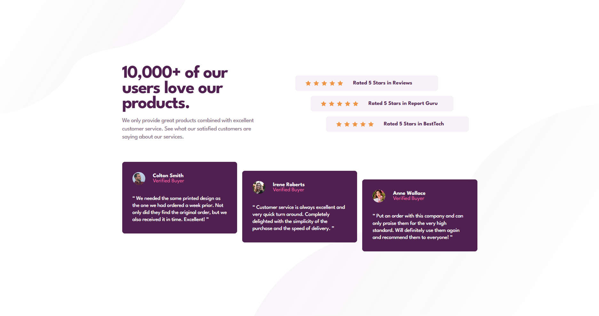

# Frontend Mentor - Social proof section solution

This is a solution to the [Social proof section challenge on Frontend Mentor](https://www.frontendmentor.io/challenges/social-proof-section-6e0qTv_bA). Frontend Mentor challenges help you improve your coding skills by building realistic projects.

## Table of contents

- [Overview](#overview)
  - [The challenge](#the-challenge)
  - [Screenshot](#screenshot)
  - [Links](#links)
- [My process](#my-process)
  - [Built with](#built-with)
  - [What I learned & Key Challenges](#what-i-learned--key-challenges)
- [Project Estimation & Retrospective](#project-estimation--retrospective)
- [Author](#author)

## Overview

### The challenge

Users should be able to:
- View the optimal layout depending on their device's screen size.
- See a responsive social proof section that shifts seamlessly between mobile, tablet (target), and desktop viewports.
- Experience a complex structural layout where distinct component groups align asymmetrically (the stepping/cascade effect).
- View a high-fidelity implementation matching the provided Frontend Mentor guidelines.

### Screenshot

  
*Fig 1. Final responsive implementation of the Social Proof Section challenge using semantic HTML5, BEM methodology, SASS/SCSS standalone blocks, CSS Grid, Flexbox, custom properties, and multiple media query layers.*

### Links

- Solution URL: [Solution Link](https://github.com/Osty-trainee/social-proof-section)
- Live Site URL: [Live Site Link](https://osty-trainee.github.io/social-proof-section/)

## My process

### Built with

- Semantic HTML5 markup featuring section wraps (`main`, `section`, `article`), blockquotes (`blockquote`), text wrappers, and optimized decorative assets.
- BEM (Block-Element-Modifier) naming convention strictly maintaining isolation between structural blocks.
- SASS / SCSS layout architecture utilizing variables, global reset imports, and nested module states.
- CSS custom properties (`:root`) for layout design tokens, tracking intervals, and the specific typography setup.
- Flexbox for responsive alignment axes, item distributions, and central grid positioning on standard mobile viewports.
- CSS Grid for cross-axis content allocation and precise page partitioning on high-definition monitors.
- Structural pseudo-classes (`:nth-child`) combined with precise variable spacing to control asymmetric geometric offsets.
- Swappable background patterns transforming across specific tablet and desktop breakpoints.

## What I learned & Key Challenges

This project served as an excellent practical deep dive into asset layering, structural layout math, and isolation scopes within a clean SASS/BEM compilation workflow.

### 1. SASS Nesting Scope & BEM Compilation Realities
One of the core architectural lessons learned during this sprint revolved around SASS ampersand (`&`) compilation paths. Initially, nesting full component modules like `.testimonial-card` inside the layout module `.social-proof` created bloated, multi-layered selector cascades in the compiled CSS. This caused browser matching failures because the selectors didn't match the simple DOM structure.

To fix this, I completely decoupled the styling into two independent BEM blocks, achieving perfect flat-compiled targets:

```scss
// Block 1: Main Section Layout
.social-proof {
  &__ratings { /* Flex column layout bounds */ }
  &__testimonials { /* Grid column rows block */ }
}

// Block 2: Decoupled Independent Component
.testimonial-card {
  display: flex;
  flex-direction: column;
  
  &__user { display: flex; }
  &__name { font-weight: 700; }
}
```

### 2. Multi-Layer Background Layer Coordinates
Managing four distinct SVG pattern assets—balancing top/bottom components tailored separately for mobile and desktop screens—required robust backdrop grouping and clean boundary overrides:

```scss
// Fluid backdrop configuration for standard viewports
body {
  background-image: 
    url('../images/bg-pattern-top-mobile.svg'),
    url('../images/bg-pattern-bottom-mobile.svg');
  background-repeat: no-repeat, no-repeat;
  background-position: top left, bottom right;
}

// Asset swap paired with precise clipping shifts on wider monitors
@media (min-width: 1100px) {
  body {
    background-image: 
      url('../images/bg-pattern-top-desktop.svg'),
      url('../images/bg-pattern-bottom-desktop.svg');
  }
}
```

### 3. Asymmetric Structural "Stepping" Cascades
Recreating the signature layout shifts for both rating плашки and testimonial blocks without breaking responsiveness was a major milestone. For the top ratings, I utilized an X-axis flex boundary combined with linear left-margin offsets:

```scss
&__ratings {
  display: flex;
  flex-direction: column;
  align-items: flex-start;

  .rating-card {
    width: 27.875rem;

    // Asymmetric cascade stepping adjustments
    &:nth-child(1) { margin-left: 0; }
    &:nth-child(2) { margin-left: 3rem; }
    &:nth-child(3) { margin-left: 6rem; }
  }
}
```

For the testimonials container below, I built a multi-column CSS Grid structure. By applying a fixed grid height and combining it with individual element alignment (`align-self`), I forced a clean vertical Y-axis shift:

```scss
&__testimonials {
  display: grid;
  grid-template-columns: repeat(3, 1fr);
  height: 17.5rem; // Dictates vertical volume required for the step cascade

  .testimonial-card {
    height: fit-content;
    
    // Vertical alignment cascade execution
    &:nth-child(1) { align-self: flex-start; }
    &:nth-child(2) { align-self: center; }
    &:nth-child(3) { align-self: flex-end; }
  }
}
```

## Project Estimation & Retrospective

- **Initial Estimation:** 3 to 4 hours.
- **Actual Time Taken:** ~4.5 hours.

**Retrospective Summary:**  
What originally looked like a basic card layout turned out to be an intricate exercise in structural design logic. This layout helped me better understand how browser engines compute flex dimensions and grid spaces. Resolving challenges like hidden color mismatches, text wrapping bugs, and structural SASS nesting constraints significantly leveled up my skills with fluid responsive grids, BEM codebases, and production-ready layouts.

## Author

- GitHub - [@Osty-trainee](https://github.com/Osty-trainee)
- Frontend Mentor - [@Osty-trainee](https://www.frontendmentor.io/profile/Osty-trainee)
